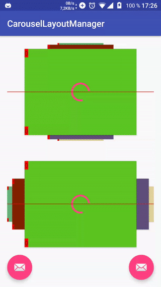
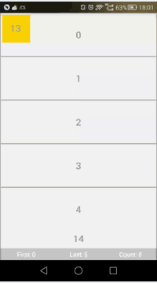
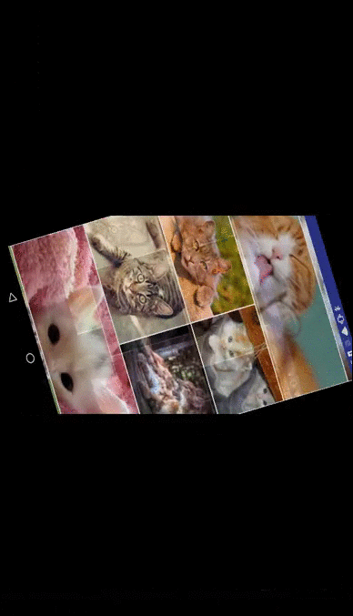
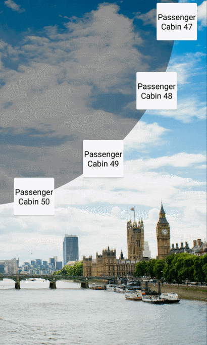

# Awesome-RecyclerView-LayoutManager

RecyclerView-LayoutManager resources

## [FanLayoutManager](https://github.com/Cleveroad/FanLayoutManager)
Using Fan Layout Manager you can implement the horizontal list, the items of which move like fan blades  

## [CarouselLayoutManager](https://github.com/Azoft/CarouselLayoutManager)
Android Carousel LayoutManager for RecyclerView  

## [ChipsLayoutManager](https://github.com/BelooS/ChipsLayoutManager)
A custom layout manager for RecyclerView which mimicric TextView span behaviour, flow layouts behaviour with support of amazing recyclerView features 

## [HiveLayoutManager](https://github.com/Chacojack/HiveLayoutManager)
这是一个蜂巢布局管理器，它可以在RecyclerView中实现像蜂巢一样的布局。 

## [vlayout](https://github.com/alibaba/vlayout)
VirtualLayout是一个针对RecyclerView的LayoutManager扩展, 主要提供一整套布局方案和布局间的组件复用的问题。 

## [flexbox-layout](https://github.com/google/flexbox-layout)
FlexboxLayout is a library project which brings the similar capabilities of [CSS Flexible Box Layout Module](https://www.w3.org/TR/css-flexbox-1) to Android. 

## [LondonEyeLayoutManager](https://github.com/danylovolokh/LondonEyeLayoutManager)
A Layoutmanager that must be used with RecyclerView. When list is scrolled views are moved by circular trajectory 

## [DiscreteScrollView](https://github.com/yarolegovich/DiscreteScrollView)
Scrollable list of items, where current item is centered and can be changed using swipes 

## [greedo-layout-for-android](https://github.com/500px/greedo-layout-for-android)
Full aspect ratio grid LayoutManager for Android's RecyclerView also:[SuitedRecyclerView](https://github.com/asdzheng/SuitedRecyclerView)
 

## [ZLayoutManager](https://github.com/mcxtzhang/ZLayoutManager)
仿探探、人人影视 炫动滑动 卡片层叠 和流式布局等。同样效果的还有[CardSwipeLayout
](https://github.com/yuqirong/CardSwipeLayout)
 

## [CustomLayoutManager](https://github.com/leochuan/CustomLayoutManager)
A Circle and a zoom layoutManager for android RecyclerView 

## [AssembleEssay](https://github.com/rantianhua/AssembleEssay)
实现一个流动布局，可以用作文章展示，也可以用作标签展示，并且可以很方便地为其添加布局动画，示例代码里添加了拖拽插入的动画，如效果图。 
 

## [GalleryLayoutManager](https://github.com/BCsl/GalleryLayoutManager)
实现 Android 中 Gallery 或者 ViewPager 控件的效果，支持垂直和水平两个方向，支持 RecycleView 的试图回收机制。 
 

## [ExpandLayoutManager](https://github.com/Azoft/ExpandLayoutManager)
Android Expandable LayoutManager for RecyclerView 
 

## [VegaLayoutManager](https://github.com/xmuSistone/VegaLayoutManager)
fade and shrink the head itemView when scrolling.
    

##  [flowlayoutmanager](https://github.com/xiaofeng-han/AndroidLibs/tree/master/flowlayoutmanager)
FlowLayoutManager is a layoutManager that works with Android RecyclerView Widget, to layout views in flow style, with support of predictive animations, item per line limit, auto measurement & alignments (left or right)

## [StackCardLayoutManager](https://github.com/amyu/StackCardLayoutManager)
This project is the movement of a new card type UI for Android  

## [TimetableLayout](https://github.com/MoyuruAizawa/TimetableLayout)
TimetableLayout is a RecyclerView.LayoutManager to display the timetable for Android. 

## [turn-layout-manager](https://github.com/cdflynn/turn-layout-manager)
A carousel layout manager for RecyclerView 

## [StackLayoutManager](https://github.com/HirayClay/StackLayoutManager)
customized layoutmanager,let item pile up like stackview/类似最美有物卡片堆叠效果
 

## [Greedo Layout for Android](https://github.com/500px/greedo-layout-for-android)
Full aspect ratio grid LayoutManager for Android's RecyclerView
 

## [CircularLayoutManager](https://github.com/leshchenko/CircularLayoutManager)
Simple in usage Recycler Layout Manager with circular item positioning.
 

## [Sticky-LayoutManager](https://github.com/qiujayen/sticky-layoutmanager)
An android recyclerView sticky item view layout manager library
 

## [CircleRecyclerView](https://github.com/kHRYSTAL/CircleRecyclerView)
the library is a loop RecyclerView(expression), can show some effects when display
 

## [StackLayoutManager](https://github.com/LittleMango/StackLayoutManager)
A RecyclerView.LayoutManager implementation which provides functionality to show a group of stack view.
 

## [Circular-Layout-Manager](https://github.com/kapil93/Circular-Layout-Manager)
 

## [RecyclerCoverFlow](https://github.com/ChenLittlePing/RecyclerCoverFlow)
 

## [FocusLayoutManager](https://github.com/CCY0122/FocusLayoutManager)
A Horizontal / vertical scroll RecyclerView-LayoutManager with focus item.
 

## [StickyHeaders](https://github.com/ShamylZakariya/StickyHeaders)
Adapter and LayoutManager for Android RecyclerView which enables sticky header positioning.
 

## [ZoomRecylerLayout](https://github.com/Spikeysanju/ZoomRecylerLayout)
An beautiful Zoom Animation Library for RecyclerView Items in Android using Kotlin.
 

## [EchelonLayoutManager](https://github.com/DingMouRen/LayoutManagerGroup)
👉 Customize the LayoutManager of RecyclerView(自定义LayoutManager)
 

## [SkidRightLayoutManager](https://github.com/DingMouRen/LayoutManagerGroup)
👉 Customize the LayoutManager of RecyclerView(自定义LayoutManager)
 

## [SlideLayoutManager](https://github.com/DingMouRen/LayoutManagerGroup)
👉 Customize the LayoutManager of RecyclerView(自定义LayoutManager)
 

## [PickerLayoutManager](https://github.com/DingMouRen/LayoutManagerGroup)
👉 Customize the LayoutManager of RecyclerView(自定义LayoutManager)
 

## [BannerLayoutManager](https://github.com/DingMouRen/LayoutManagerGroup)
👉 Customize the LayoutManager of RecyclerView(自定义LayoutManager)
 

## [ViewPagerLayoutManager](https://github.com/DingMouRen/LayoutManagerGroup)
👉 Customize the LayoutManager of RecyclerView(自定义LayoutManager)
 

